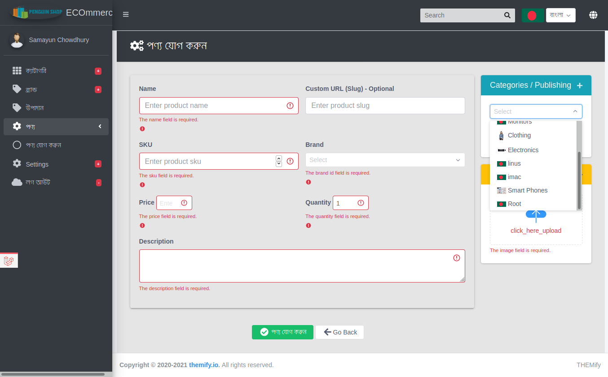
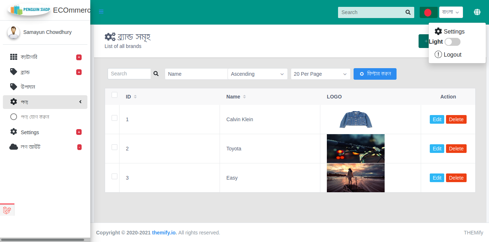
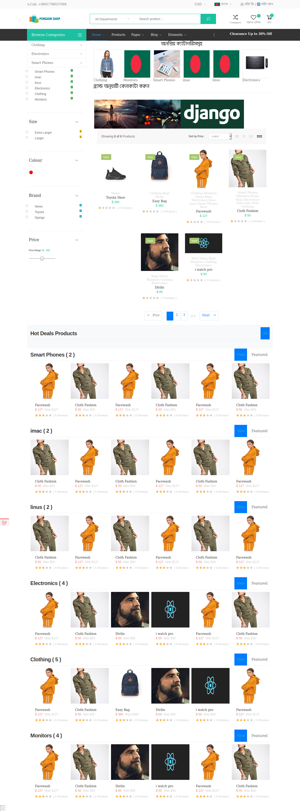

<p align="center">
</p>
<p align="center">


</p>

## :heart: Application Name: <b style="color:green;"> E Penguin Shop </>

<p> Single Vendor Ecommerce web application </p>
</b>



<p style="text-align:center"> (Image:  Admin Dashboard Dark Theme ) </p>



<p style="text-align:center"> (Image:  Admin Dashboard (Light Theme)) </p>



<p style="text-align:center"> (Image:  Home Page  </p>

## :hugs: Requirements

        *  PHP >= 7.3
        *  MySQL
        *  Apache
        *  Laravel >= 8.0
        *  Composer

## :clap: Installation:

```bash
    composer install

    npm install

    cp .env.example .env

    # Database Connection on .env

    php artisan cache:clear

    php artisan key:generate

    # First Time
    php artisan migrate:fresh --seed

    # After first time migration
    php artisan migrate

    php artisan db:seed

    mkdir public/storage && cp .storage/** public/storage -r

    php artisan storage:link

    # Run Backend Server by Terminal
    php artisan serve

    # Run Frontend Server by Terminal
    npm run watch-poll

```

<table width="80%" style="margin-top:10px;margin-bottom:10px;color:yellow;font-weight:bold;background:#012;">
    <thead>
        <th style="text-align:center;margin-left: 120px;width:40%;color:#fff">Packages</th>
        <th style="text-align:center;margin-left: 120px;width:40%;color:#fff"> Install Command </th>
    </thead>
    <tbody>
        <tr>
            <td> "laravel/ui": "^3.0" </td>
            <td> composer require laravel/ui --dev </td>
        <tr> 
            <td>  "silviolleite/laravelpwa": "^2.0" </td>
            <td>  composer require silviolleite/laravelpwa </td>
        </tr> 
    </tbody>
</table>

## :hand: Features

-   #### ;) Backend
    -   **Caching**
    -   Authentication : ( _Multi Guard_ ) Session based Authentication
    -   **Repository Pattern**
    -   Packages & Stub
    -   Model Observer ( used for cache deleting)
    -   Authorization: Gate, Policies
    -   Requests, Validation , Refactoring & File Upload
    -   Scope Filter in Model
    -   ## ORM for MySQL ( Elequent ORM )
-   ### :\* Frontend:
    -   Frontend Framework : `Vue Js`
    -   Library : `IViewUi`, `Vue-owl-carousel`,`VueX`,`Vue-router`,`lodash`,`jQuery`,`axios`
    -   `Admin LTE 3` in Admin Panel & Molla Ecommerce Template in Frontend
    -   **Dynamic/ Auto Import Modules (Store, Routes) in frontend**
    -   **Localization : Mutliple Languege (Bangla :bangladesh: + English :us: implemented) by `vue-i18n`**
    -   Light/Dark Theme & Grid/List Layout
    -   <u color="red">Code Spliting , Lazy Loading </u>, Less Ajax request
    -

<table width="80%" style="margin-top:10px;margin-bottom:10px;color:yellow;font-weight:bold;background:#210;">
    <thead>
        <th style="text-align:center;margin-left: 120px;width:40%;color:#fff">Node Packages</th>
        <th style="text-align:center;margin-left: 120px;width:40%;color:#fff"> Install Command </th>
        <th style="color:#fff"> Why Use It  </th>
    </thead>
    <tbody>
        <tr>
            <td> "@fortawesome/fontawesome-free": "^5.15.1", </td>
            <td> npm install @fortawesome/fontawesome-free </td>
        <tr> 
            <td>   "admin-lte": "^3.0.5" </td>
            <td> npm install admin-lte </td>
            <td> Open Source Dashboard </td>
        </tr>
        <tr> 
            <td>  "moment": "^2.29.1" </td>
            <td> npm install admin-lte </td>
        </tr> 
        <tr> 
            <td> "view-design": "^4.4.0-rc.4"," </td>
            <td> npm install view-design </td>
            <td> UI Widget Component Library </td>
        </tr>
        <tr> 
            <td> "vue-i18n": "^8.22.1"," </td>
            <td> npm install vue-i18n </td>
            <td> Localization </td>
        </tr> 
        <tr> 
            <td> "vform": "^1.0.1"," </td>
            <td> npm install v-form </td>
            <td> Form Validation </td>
        </tr> 
        <tr> 
            <td> "vuex": "^3.5.1" </td>
            <td> npm install vuex </td>
            <td> State Management </td>
        </tr> 
        <tr> 
            <td> "vue-router": "^3.4.6", </td>
            <td> npm install vue-router </td>
            <td> Routing   </td>
        </tr> 
        <tr> 
            <td> "vuex-extensions": "^1.1.5", </td>
            <td> npm install vue-extensions </td>
            <td> RESET State & Mixins in Vuex (Tiny package) </td>
        </tr> 
        <tr> 
            <td>"vue-owl-carousel": "^2.0.3", </td>
            <td> npm install vue-owl-carousel </td>
            <td> Owl Carousel   </td>
        </tr> 
        <tr> 
            <td> "vuex-persistedstate": "^4.0.0-beta.1" </td>
            <td> npm install vue-router </td>
            <td> Routing   </td>
        </tr> 
        <tr> 
            <td>"vue-magnifier": "^1.0.6", </td>
            <td> npm install vue-magnifier </td>
            <td>  Zoom Image  </td>
        </tr> 
        <tr> 
            <td>"vue-awesome-notifications": "^3.1.1", </td>
            <td> npm install vue-awesome-notifications </td>
            <td>    </td> 
        </tr> 
        <tr> 
            <td> "@zeitiger/elevatezoom": "^2.5.4", </td>
            <td> npm install @zeitiger/elevatezoom </td>
            <td>    </td>
        </tr>
    </tbody>
</table>

## :sa: Roles:

<table>
    <thead>
        <th>Role</th>
        <th>URL</th>
        <th>Email</th>
        <th>Password</th>
        </thead>
    <tbody>
        <tr> 
            <td>Admin</td>
            <td> /admin/login </td>
            <td>admin@admin.com</td>
            <td> 123456 </td>
        </tr>
        <tr> 
            <td> Customer / User </td>
            <td> `/login` </td>
            <td>user@user.com</td>
            <td>123456</td>
        </tr>
    </tbody>
</table>

:heart: Happy Coding :clap: 🚀

