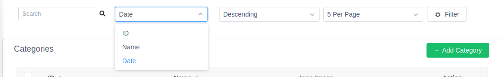
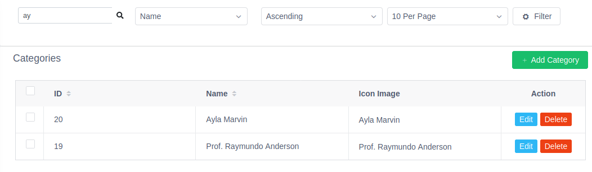
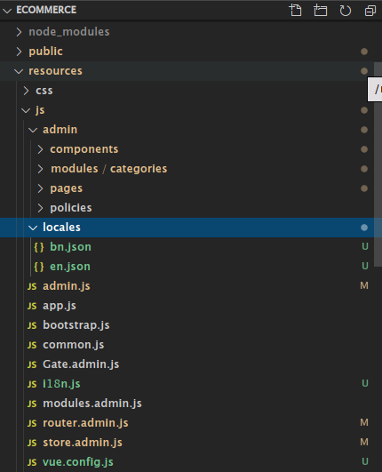
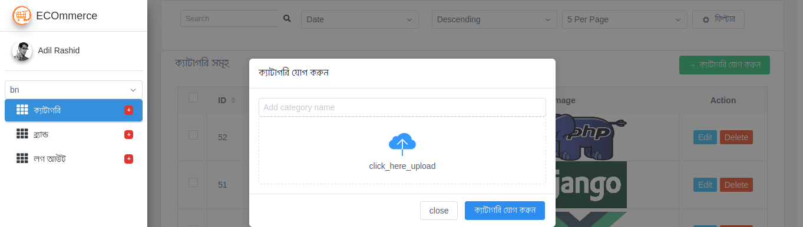
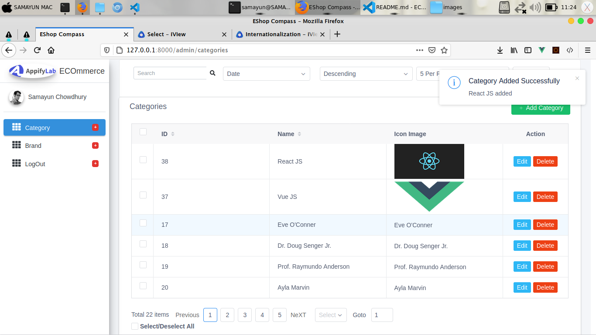

#### Php artisan commands
``` console
    composer create-project --prefer-dist laravel/laravel ECommerce "8"
    composer require laravel/ui --dev
    php artisan ui vue --auth
    npm install admin-lte vue-router vuex @fortawesome/fontawesome-free moment vform view-design
    npm install
    npm run watch 
```

> ### <h2 style="color:green;background:#eee;padding-left:13px;"> How to Sorting , Paginating and Filtering </h2>
</br> 

### Step-1: Pagination.vue
``` javascript
    [...]
    <template>
        <Page
            :total="filterString.total"
            :current="filterString.page"
            :page-size="filterString.perPage"
            @on-change="changePaginatedPage"
            @on-page-size-change="changePaginatedPerPage"
            show-total
            show-elevator
            show-sizer
            prev-text="Previous"
            next-text="NeXT"/>
    </template>
    <script>
        import { mapActions, mapGetters } from 'vuex'
        export default {
            computed: {
            ...mapGetters("categoriesStoreIndex",['filterString']),
        },
        methods:{
            ...mapActions("categoriesStoreIndex" , ['changePaginatedPage','changePaginatedPerPage'])
        }
    }
    </script>

```
### Step - 2: State Management
``` js
export default {
    state: {
        filterString:{
            page: 1,
            perPage : 6,
            orderBy: 'created_at',
            sortBy: 'desc',
            q: "",
            total: 0
        }
    },
    getters: {
       filterString         : state => state.filterString,
       getFilteredURLString : state => {
           let {page,perPage,orderBy,sortBy,q} = state.filterString;
           let queryString = "";
           if (q != "") {
              queryString = `page=1&q=${q}`
           } else {
              queryString = `page=${page}`
           }
           (perPage !="") ? queryString += `&perPage=${perPage}` : null;
           (orderBy !="") ? queryString += `&orderBy=${orderBy}` : null;
           (sortBy !="") ? queryString += `&sortBy=${sortBy}` : null;

           return queryString;
       }
    },
    actions : {
         async getCategories({commit ,state , getters}){
           try {
            commit('SET_IS_LOADING' , true)
            let res =   await axios.get(`/api/admin/categories?${getters.getFilteredURLString}`);
            if (res.status == 200) {
                let updatedFilterString = {
                    page: parseInt(res.data.current_page),
                    perPage :parseInt(res.data.per_page),
                    total: parseInt(res.data.total)
                }
                commit('FILTER_DATA', updatedFilterString)
                commit('FETCH_CATEGORIES' , res.data.data);
                commit('SET_IS_LOADING' , false)

             }
           } catch (error) {
                commit('SET_IS_LOADING' , false)
               if (error.response.status == 403) {
                  $Notice.error({
                        title: 'Category FETCH Failed!',
                        desc: error.response.data.message
                    });
               }

           }
        },
        changePaginatedPage({state,commit ,dispatch } , page){
           commit('FILTER_DATA', {page})
           dispatch('getCategories')
        },
        changePaginatedPerPage({state,commit , dispatch} , perPage){
            commit('FILTER_DATA', {perPage})
            dispatch('getCategories')
        }
    },
    mutations: {
        FETCH_CATEGORIES(state , categories){
            state.categories = categories
        },
        FILTER_DATA(state , payload){
            //  state.filterString = payload
            // update only @given credentials 
            for(let obj in payload){
                state.filterString[obj] = payload[obj]
            }
        },
    }
}
```

[](docs/images/pagination.png)

* ### Step-3 Backend
``` php
// web.php
    [...]
<?php
    use Illuminate\Support\Facades\Route;
    use App\Http\Controllers\Admin\CategoryController;

    Route::group(['prefix' => 'api/admin' , 'middleware' => 'auth:admin' ], function () {
        Route::resource('categories' , CategoryController::class);
    });
    [...]
 
```

``` php
<?php
namespace App\Models;

use Illuminate\Database\Eloquent\Factories\HasFactory;
use Illuminate\Database\Eloquent\Model;

class Category extends Model
{
    use HasFactory;

    protected $guarded = [];

    public function scopeSearch($query , $q)
    {
        if($q == null) return;
        return $query->where('name','LIKE', "%$q%");
    }
}

```

``` php
<?php

namespace App\Http\Controllers\Admin;

use App\Http\Controllers\Controller;
use App\Policies\CategoryPolicies;
use App\Models\Category;
use Illuminate\Http\Request;


class CategoryController extends Controller
{
    public function __construct()
    {
        $this->authorizeResource(Category::class, 'category');
    }
    public function index(Request $request){
        $perPage =  $request->has('perPage') ? $request->query('perPage') : 5;
        $orderBy =  $request->has('orderBy') ? $request->query('orderBy') : 'created_at';
        $sortBy  =  $request->has('sortBy') ? $request->query('sortBy') : 'desc';
        $q       =  $request->has('q') ? $request->query('q') : '' ;
        // these code must be efactored - we wil need this again and again
        return Category::search($q)->orderBy($orderBy , $sortBy)->paginate($perPage );
    }
}
```
### Now Test in browser :smile:

### Reusable Single File Pagination Component
```js
    <template>
        <Page
            :total="meta.total"
            :current="meta.page"
            :page-size="meta.perPage"
            @on-change="changePaginatedPage"
            @on-page-size-change="changePaginatedPerPage"
            show-total
            show-elevator
            show-sizer
            prev-text="Previous"
            next-text="NeXT"/>
    </template>
    <script>
        export default {
            props: {
                meta : {
                    type: Object ,
                    required : true
                },
                changePaginatedPage : {
                    type: [Object , Function]
                },
                changePaginatedPerPage : {
                    type: [Object , Function]
                },
            }
        }
    </script>

```
> Use it in your project like this >>


``` js
<Pagination :meta="filterString"
    :changePaginatedPage="changePaginatedPage" 
        :changePaginatedPerPage="changePaginatedPerPage" />

    [...]

import {mapState, mapActions, mapMutations, mapGetters } from 'vuex'
export default {
   name : "viewCategoriesComponent",
   components:{Pagination},
    computed: {
            ...mapState("categoriesStoreIndex", [ 'showEditModal' , 'editData','isLoading' , 'isEditing','errors' ,'multiSelected' ]),
            ...mapGetters("categoriesStoreIndex",['getAllCategory','filterString' ])
    },
    methods:{
            ...mapActions("categoriesStoreIndex", ['changePaginatedPage','changePaginatedPerPage']),
    }
}
[...]
```
# <h2 style="color: #2f6;backgroundd:#333;padding-left:15px;">Filtering , Searching & Sorting via VueX </h2>
>Reusable FilterData.vue File

``` javascript
<template>
    <Card translate="bn" type="primary">
        <Row>
            <Col span="5" class="mr-2">
                <form class="form-inline ml-3 mb-4" @submit.prevent="getResult">
                    <div class="input-group input-group-sm">
                    <input class="form-control form-control-navbar" type="search" placeholder="Search" aria-label="Search" v-model="defaultFilter.q" >
                    <div class="input-group-append">
                        <button class="btn btn-navbar" type="submit">
                        <i class="fas fa-search"></i>
                        </button>
                    </div>
                    </div>
                </form>
            </Col>
            <Col span="5" class="mr-2">
                <i-select v-model="defaultFilter.orderBy" style="width:200px">
                    <i-option v-for="item in orderList" :value="item.value" :key="item.value">{{ item.label }}</i-option>
                </i-select>
            </Col>
            <Col span="5" class="mr-2">
                <Select v-model="defaultFilter.sortBy" >
                    <Option v-for="(sort,i)  in SortList" :key="i" :value="sort.value"> {{ sort.label }} </Option>
                </Select>
            </Col>
            <Col span="5" class="mr-2">
                <Select v-model="defaultFilter.perPage">
                    <Option v-for="(per,i)  in perPageList" :key="i" :value="per.value"> {{ per.label }} </Option>
                </Select>
            </Col>
            <Col span="3">
                <Button type="default" @click="getResult" icon="ios-settings"> Filter </Button>
            </Col>
        </Row>
    </Card>
</template>

<script>
export default {
    name : "FilterData" ,
    props:{
        defaultFilter: Object,
        getResult: [Function]
    },
    data(){
        return {
            perPageList : [{
                            label : "5 Per Page" ,
                            value : 5
                        },
                        {
                            label : "10  Per Page" ,
                            value : 20
                        },
                        {
                            label : "20  Per Page" ,
                            value : 20
                        },
                        {
                            label : "30  Per Page" ,
                            value : 30
                        },
                        {
                            label : "40  Per Page" ,
                            value : 40
                        },
                        {
                            label : "50  Per Page" ,
                            value : 50
                        },
                        {
                            label : "80  Per Page" ,
                            value : 80
                        },
                        {
                            label : "100  Per Page" ,
                            value : 100
                        },
                        {
                            label : "200  Per Page" ,
                            value : 200
                         }],
            orderList : [{ label : "ID" ,value : "id" },
                        {label : "Name" ,value : "name" },
                        { label : "Date" ,value : "created_at"}],
            SortList : [{
                            label : "Ascending" ,
                            value : "asc"
                        },
                        {
                            label : "Descending" ,
                            value : "desc"
                        }]
        }
    }
}
</script>
```
> OUTPUT of FilterData.VUE
[](docs/images/FilterData.vue.png)

> Categories.vue 
``` js
<template>
    <div class="content bg-transparent">
        <div class="container-fluid">
            <filter-data
              :defaultFilter="filterString"
              :getResult="getCategories" ></filter-data>
            <!--~~~~~~~ TABLE ONE ~~~~~~~~~-->
            <div class="card p-2">

            <p class="card-title ml-3">Categories
            <!--  adding modal -->
            <add-modal-component v-if="isPermitted('create','category')"></add-modal-component> </p>

            <div class="card-body">
                <view-categories-component v-if="isPermitted('view','category')"></view-categories-component>
            </div>

            <!-- edit Modal -->
            <edit-modal-component v-if="isPermitted('update','category')"></edit-modal-component>
            </div>

        </div>
    </div>
</template>

<script>
import { mapActions, mapGetters } from 'vuex'
import addModalComponent from "../component/addModalComponent"
import editModalComponent from "../component/editModalComponent"
import viewCategoriesComponent from '../component/viewCategoriesComponent';
import FilterData from '../component/FilterData';

export default {
    components: {
        addModalComponent,
        editModalComponent,
        viewCategoriesComponent,
        FilterData
    },
    computed: {
       ...mapGetters("categoriesStoreIndex",['filterString' ])
    },
    methods:{
        ...mapActions("categoriesStoreIndex", ['getCategories'])
    }
}

</script>
```

> OUTPUT
[](docs/images/filter_result.png)

> ## <p style="color:green;font-size:20px;">Now Preparing project for Localization & Translating</p>


Run this npm command

    npm install vue-i18n vuex-persistedstate

### Create i18n.js ( It acts like plugin)

``` javascript
import Vue from'vue'
import VueI18n from 'vue-i18n'

Vue.use(VueI18n);
function checkDefaultLanguage() {
    let matched = null
    let languages = Object.getOwnPropertyNames(loadLocaleMessages())
    languages.forEach(lang => {
      if (lang === navigator.language) {
        matched = lang
      }
    })
    if (!matched) {
      languages.forEach(lang => {
        let languagePartials = navigator.language.split('-')[0]
        if (lang === languagePartials) {
          matched = lang
        }
      })
    }
    return matched
  }
function loadLocaleMessages() {
    const locales = require.context(
      "./locales",
      true,
      /[A-Za-z0-9-_,\s]+\.json$/i
    );
    const messages = {};
    locales.keys().forEach(key => {
      const matched = key.match(/([A-Za-z0-9-_]+)\./i);
      if (matched && matched.length > 1) {
        const locale = matched[1];
        messages[locale] = locales(key);
      }
    });
    return messages;
  }
  export const selectedLocale = localStorage.getItem('locale')  || checkDefaultLanguage() || process.env.VUE_APP_I18N_LOCALE || 'en'
  export const languages = Object.getOwnPropertyNames(loadLocaleMessages())

  export default new VueI18n({
    locale: selectedLocale,
    fallbackLocale: process.env.VUE_APP_I18N_FALLBACK_LOCALE || 'en',
    messages: loadLocaleMessages()
  })

```

Create `vue.config.js` 
``` js
    module.exports = {
        pluginOptions: {
        i18n: {
            locale: "en",s
            fallbackLocale: "en",
            localeDir: "locales",
            enableInSFC: false
        }
        }
    };
```
 Folder Structure must like this (@ above code )

[](docs/images/localization_folder_structure.png)

## STORE

``` js
    //  /modules/setings/store/index.ja
    import Vue from 'vue';
    import Vuex from 'vuex';
    // import axios from "axios";
    import createPersistedState from 'vuex-persistedstate'
    import i18n, { selectedLocale } from '../../../i18n'
    Vue.use(Vuex);

    export default new Vuex.Store({
        state: {
            locale: selectedLocale
        },
        actions: {
            changeLocale({ commit }, newLocale) {
                i18n.locale = newLocale // important!
                commit('UPDATE_LOCALE', newLocale)
            }
        },
        mutations: {
            UPDATE_LOCALE(state, newLocale) {
                state.locale = newLocale
                // added after bug fix ( addData.errors.has not a function)
                localStorage.setItem('locale',newLocale)
            }
        },
        plugins: [createPersistedState()]
});


```

``` js
    //admin.js

    import router from './router.admin'
    import i18n, { selectedLocale } from './i18n'
    // IMPORT THE STORE
    import store from './store.admin';

    router.beforeEach((to, from, next) => {
        // if (store.state.locale !== selectedLocale) {
        //     store.dispatch('changeLocale' , store.state.locale)
        // }
        // changed
        let locale = store.state.settingsStoreIndex.locale
        if (locale !== selectedLocale) {
            store.dispatch('settingsStoreIndex/changeLocale', locale)
        }
    }
```

# Resuable LanguegeSwitcher.vue Component
``` js
        <template>
            <Select v-model="current_languege">
                <Option
                    v-for="(lang,i) in langArray"
                    :key="`lang${i}`"
                    :value="lang"
                > {{lang}} </Option>
            </Select>
        </template>

        <script>
        import { languages } from '../../i18n'
        export default {
        data() {
            return {
            langArray: languages
            }
        },
        computed: {
            current_languege: {
            get: function() {
                return this.$store.state.settingsStoreIndex.locale
            },
            set: function(newVal) {
                this.$store.dispatch('settingsStoreIndex/changeLocale', newVal)
            }
            }
        }
        }
        </script>

```
### very basic example

// locale/en.json
``` json
{
    "loading" : "Loading",
    "edit" : "Edit",
    "delete" : "Delete",
    "name": "Name",
    "image" : "Image",
    "sidebar": {
        "category" : "Category",
        "brand" : "Brand",
        "logout" : "logout"
    },
    "categories" : {
        "name" : "Categories",
        "add": "Add @:sidebar.category",
        "edit" : "Edit @:sidebar.category",
        "delete" : "Delete @:sidebar.category"
    },
    "brands" : {
        "name" : "Brands",
        "add": "Add @:sidebar.brand",
        "adding": " Adding...",
        "edit" : "Edit @:sidebar.brand",
        "editing" : "Editing @:sidebar.brand",
        "delete" : "Delete @:sidebar.brand"

    },
    "filter":{
        "name" : "Filter"
    }
}

```
// locale/bn.json
``` json
{
    "loading" : "লোডিং হচ্ছে",
    "edit" : "সম্পাদনা করুন",
    "delete" : "মুছে ফেলুন",
    "name": "নাম",
    "image" : "ছবি",
    "sidebar": {
        "category" : "ক্যাটাগরি",
        "brand" : "ব্র্যান্ড",
        "logout" : "লগ আউট"
    },
    "categories" : {
        "name" : "ক্যাটাগরি সমূহ",
        "add": "@:sidebar.category যোগ করুন",
        "adding": "@:sidebar.category যোগ করা হচ্ছে",
        "edit" : "@:sidebar.category এডিট ",
        "delete" : "@:sidebar.category ডিলেট করুন"

    },
    "brands" : {
        "name" : "ব্র্যান্ড সমূহ",
        "add": "@:sidebar.brand যোগ করুন",
        "adding": "@:sidebar.brand যোগ করা হচ্ছে",
        "edit" : "@:sidebar.brand @:edit",
        "editing" : "@:sidebar.brand সম্পাদনা করা হচ্ছে",
        "delete" : "@:sidebar.brand @:delete"

    },
    "filter":{
        "name" : "ফিল্টার করুন"
    }
}

```
### OUTPUT of Languege Switcher



># Here is final output of categories

[](docs/images/categories.vue.png) 

> # PHP Artisan Clear Commands  
    php artisan config:clear && php artisan route:clear && php artisan view:clear


 So, what's NeXT ? 
* Cloud  Storage (AWS S3) 
* Caching , Queue with redis 
* Emailing , Event Listener , Observer ?? Notifications 

<p> :smile: much much fun are coming.. so stay with me. </p>

<h4>Happy Coding :smile: </h4>
