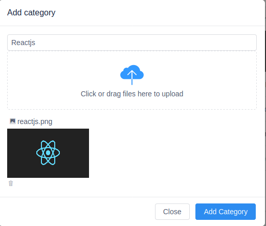

>## Project : Ecomerce by Laravel 8 and Vue 2
$ 
 ### Php artisan commands
``` console
 composer create-project --prefer-dist laravel/laravel ECommerce "8"
 composer require laravel/ui --dev
 php artisan ui vue --auth
 npm install admin-lte vue-router vuex @fortawesome/fontawesome-free moment vform view-design
 npm install
 npm run watch
```

 How to upload image by iViewUi 
 
##### Step-1: Make a route for uploading image
``` bash
    [...]
    use App\Http\Controllers\Admin\CategoryController;

    Route::group(['prefix' => 'api/admin' , 'middleware' => 'auth:admin' ], function () {
        # Route::post('categories/multi' , [CategoryController::class , 'multiDelete']);
        # Route::resource('categories' , CategoryController::class);
        Route::post('/upload', [CategoryController::class ,'upload']);
    });
    [...] 
    use Illuminate\Http\Request;
    public function upload(Request $request){
        $this->validate($request,[
            'file' => 'bail|mimes:jpg,jpeg,png|image'
        ]);
       $picName = time().'.'.$request->file->extension();
       $request->file->move(public_path('uploads/categories'),$picName);
       return $picName;
    }
```
## Step - 2: Use Upload Component In AddComponentModal 
``` bash
 <template>
        <Upload
            ref="uploads"
            type="drag"
            multiple="false"
            :headers="{'x-csrf-token' : token, 'X-Requested-With' : 'XMLHttpRequest'}"
            :on-success="handleSuccess"
            :on-error="handleError"
            :format="['jpg','jpeg','png']"
            :max-size="2048"
            :on-format-error="handleFormatError"
            :on-exceeded-size="handleMaxSize" 
            action="/api/admin/upload"
        > 
          <div style="padding: 20px 0">
             <Icon type="ios-cloud-upload" size="52" style="color: #3399ff"></Icon>
              <p>Click or drag files here to upload</p>
          </div>
        </Upload>
</template>
<script>
import {mapState, mapActions, mapMutations } from 'vuex'

export default {
    name: "addModalComponent",
    computed:{ 
        ...mapState("categoriesStoreIndex", [
          'showModal' ,'isLoading', 'isAdding' ,'addData'
       ]),
    },

    methods:{
         ...mapActions("categoriesStoreIndex", ['addCategory' , 'handleMaxSize' ,'handleFormatError' ,'handleSuccess','handleError' ]),
         ...mapMutations("categoriesStoreIndex" , ['TOGGLE_MODAL' ]),

    },
    async created(){
        this.token = window.Laravel.csrfToken;
    }

}
</script>
```

##Step-2 Handle Methods like this



``` js
// import axios from "axios"; // already imported in ./bootstrap.js
import { Form } from "vform";

export default {   
    state: {
        addData : new Form({
            name:"",
            icon :""
        }),
        errors: {},
        isIconImageNew: false,
        isEditingItem: false,
       
    },

    actions: {
        handleSuccess({state},res) {
            res = `/uploads/categories/${res}`;
            if (state.isEditingItem) {
                console.log("inside");
                return (state.addData.icon = res);
            }
            return state.addData.icon = res;
        },
        handleError(res, file) {
            $Notice.warning({
                title: "The file format is incorrect",
                desc: `${file.errors.file.length ? file.errors.file[0]: "Something went wrong!"}`
            });
        },
        handleFormatError(file) {
            $Notice.warning({
                title: "The file format is incorrect",
                desc: "File format of " +file.name +" is incorrect, please select jpg or png."
            });
        },
        handleMaxSize(file) {
            $Notice.warning({
                title: "Exceeding file size limit",
                desc: "File  " + file.name + " is too large, no more than 2M."
            });
        },
    }
```
### Now Test in browser

